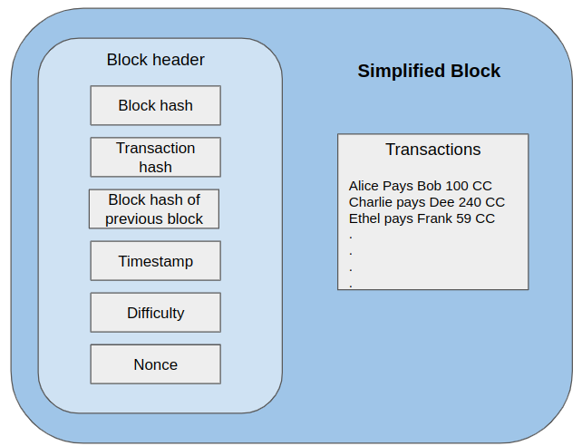

# The Blockchain Data Structure

Recall from the [Introduction](./bc_proto_intro.md) that the term blockchain can refer to at least three different concepts, one of them being the core data structure that is used to implement the distributed ledgers. In this article we look at this data structure.

The main challenge one has to contend with when designing a data structure to contain the transactions in a distributed ledger is that each node will have its own local copy of the data structure and hence be free to modify it. So there needs to be mechanisms to ensure that nodes maintain a view of the ledger that is consistent across the network. This view of the ledger includes both the contents of the transactions and the order in which these transactions were executed.

The solution that the blockchain technology offers to this problem comes in the form of the blockchain data-structure and the [blockchain consensus algorithm](/bc_proto_consensus_algorithm.md). These two play off of each other to set up a protocol and incentive mechanism to ensure that the nodes are honest in terms of the contents and ordering of the transactions.

In particular, the blockchain data-structure ensures that

**A.**  it is computationally (see note) very expensive to create it

**B.**  it is computationally very expensive to modify entries, with the cost increasing linearly with the age of an entry

**C.** it is computationally cheap to verify that a structure is a valid blockchain data structure.

The full utility of these will not become fully clear until after we have had a chance to study the consensus algorithm. However, right out of the gate we can see that the above properties together imply that once created, it will be very expensive to tamper with a blockchain without getting caught. Indeed, the difficulty can be adjusted as needed and the bigger the ledger is and older the transaction, the more infeasible it becomes.

> Note: In general there are other measures of expense that can be used when constructing a blockchain, like reputation or stake in the consistency of the blockchain. We discuss them in [here](final words)

At a high level, the blockchain is a [linked list](https://en.wikipedia.org/wiki/Linked_list) where each item in the list is _block_ and the links have some constraints that depend on the contents of the block. In the following we first describe what is contained in each block and then describe how these blocks are chained together. Along the way, we use python-like pseudo-code to make the ideas concrete, and refer to python implementations of the same ideas for detailed self-study later on. We begin by discussing some technical preliminaries needed to explain the operation of blocks.

## Hashing Perliminaries

The properties (A), (B) and (C) of blockchains are achieved through the clever use of hash functions and computationally expensive cryptographic _puzzles_. We now discuss some relevant properties of both.

### Uniqueness of Hash Functions

[Hash functions](https://en.wikipedia.org/wiki/Hash_function) like [SHA-256](https://en.wikipedia.org/wiki/SHA-2) are very well known concepts in computer science. The blockchain datastructure relies very heavily on the well known "uniqueness property" of these. This property means that given two different strings, say `string-1` and `string-2`, with very high probability, `SHA-256(string-1)` will be different from `SHA-256(string-2)`. You can check this by running the sha256 python function in the python code linked to below on many different strings.

It is important to understand that it is generally safe to assume that the probability of _collision_ (that is two different strings having the same hash) in practice is `0`. For instance for SHA-256 the collision probability is `1.47*10^(-29)` - roughly the same as flipping a fair coin and getting `~97` heads in a row, a practical impossibility. If for any reason you are not happy with this probability, you can always switch to a hash function with a even smaller collision probability, at the cost of higher computational cost.

The reason the uniqueness property is useful is that, for long strings (like some piece of data), the hash acts like a thumbprint or a signature which we can store without needing to store the string itself. If subsequently we are presented with a string which is being claimed as the original string, we can calculate the hash of the new string and compare with the stored hash to validate this claim. This property will come in very handy below.

### Cryptographic Puzzles

Crypotgraphic hash puzzles are used to to make it difficult to tamper with a blockchain data structure. The main property of these puzzles that is used is that they are very computationally expensive to solve and computationally very cheap to verify. These puzzles are based on the so-called _one-way_ property of hash functions which is that given the hash of a particular string it is not possible to compute what the original string was without actually systematically going through all possible strings and checking which string matches the given hash string. Given this, the puzzle is defined as follows.

We are given a string `s` for which we create the puzzle. The puzzle has an associated difficulty level `d` which is a positive whole number. Given a hash function `hash` the puzzl is to find the number `n` such that `hash(sn)` is starts with `d` zeros. The following pseudocode shows how to solve this puzzle and then how to verify a solution:
```python
def solve_puzzle(s: str, d: int):
    nonce = 0
    prefix = repeat('0', d) # a string with d 0s
    h = hash(s + str(nonce)) # '+' = concatenate
    while h[0:d] != prefix:
        nonce = nonce + 1
        h = hash(s + str(nonce))
    return nonce


def check_solution(s: str, nonce:str , d:int):
    prefix = repeat('0', d) # a string with d 0s
    return hash(s + str(nonce))[0:d] == prefix
```
[Add some examples]

## Blocks

The purpose of a block is to store a set of transactions, their ordering, and some additional information to ensure properties (A) to (C). Each block holds the same number of transactions, and this number is a user parameter. The transactions within a block are ordered, and this ordering together with the ordering of the blocks in the blockchain determine the ordering of the transactions in the distributed ledger as a whole.  At a high level, each block consists of the following components (see _Figure: Blockchain Basic_):

1. a set of transactions in the ledger in the form of a Merkel tree (more on this in the [Merkel Tree article](./bc_proto_merkel_tree.md)) 

2. link to the previous block in the chain

3. information certifying that the block was created in a way that may be trusted.


<figcaption align = "center"><b> Figure: Blockchain Basic</b></figcaption>

Each block is identified by a block-header and the link to the previous block in the chain is just the block-header of the previous block. To keep the length of this document reasonable, we will now look at a simplified version of a block where instead of a Merkel tree we use an array to store the transactions, and revisit the full version using Merkel tree in the [next article](./bc_proto_merkel_tree.md) in the series.

### The Simplified Block

Each block in the simplified version of our blocks will have the following components: 

1. an array of transactions, each of which is just some text (i.e. a string)

2. a link to the previous block in the chain in the form of a _previous-block-header_ which is a fixed length hexadecimal string (64 bytes in our implementation)

3. the solution to a cryptographic mining puzzle called a _nonce_

4. _timestamp_ of when the block was created

5. a _block-header_  which is also a fixed length hexadecimal string (64 bytes in our implementation), which serves as an id of the block and a thumbprint of its contents.

The following pseuodecode illustrates this:

```C
struct Block:
    block_header: str
    transactions_list: [str]
    previous_block_header: str
    nonce: str
    timestamp: datetime
```

We will refer to the transactions, the previous-block-header, and the timestamp as the *data* of the block as the other data are calculated from these.

### Creating a Block

The parameters that go into createing a block are the following:

1. the array of transactions (each of which is a string)
2. header of the previous block (or if it is the first block in the chain, just some default string)
3. and the nonce.

The pseduocode for the creation is given below, and a  python implementation is [here](../blockchain_proto/blockchain_ds.py).
```python
def create_new_block(transaction_list: [str],
                     prev_block_header: str,
                     nonce: str,
                     difficulty_level: nat
                     timestamp: datetime):

    if prev_block_header is not NULL:
        prev_block_header_checked = prev_block_header
    else: # First block in the chain
        prev_block_header_checked = "NO_PRECEDING_BLOCKS"

    block_header = create_block_header(
            transcations_list,
            prev_block_header_checked,
            nonce,
            difficulty_level,
            timestamp
    )

    new_block = new Block(
            block_header,
            transactions_list,
            previous_block_header,
            nonce,
            timestamp
    )

    return new_block
```
The pseudo-code for the creation is quite self explanatory - the main interesting thing that happens is the creation of the block header, which is what we look at now.

### Creating The Block Header

The pseudocode for creating a block header is given below. In creating the block header, the goal is to encode the transactions in the block, the previous block header (which, recall, is the id of the previous block in the chain) and the nonce in the block-header by hashing. This way, the block header serves as a thumbprint of the data in the block, and we can very cheaply verify whether any of the datum was changed by recomputing the block header. We will discuss this in detail below.

```python
def create_block_header(transcations_list: [str],
                        prev_block_header_checked: str,
                        nonce,
                        difficulty_level: nat
                        timestamp: datetime):

    # create an intermediate block header
    intermediate_header, flattened_block_data = create_iht_and_fbd(
                            transcations_list,
                            prev_block_header_checked,
                            timestamp)

    # check if the nonce is a solution for the intermediate header
    is_solved = check_solution(
                    intermediate_header,
                    difficulty_level,
                    nonce
                )
    if not is_solved:
        return NULL

    # create the block header by hashing
    block_header_string = concatenate(
                                intermediate_header,
                                nonce,
                                flattened_block_data)
    block_header = hash(block_header_string)
    return block_header


def create_iht_and_fbd(transcations_list: [str],
                       prev_block_header_checked: str,
                       timestamp: datetime):
    flattened_transactions = concatenate(transactions_list)
    flattened_block_data = concatenate(
                                flattened_transactions,
                                prev_block_header_checked,
                                str(timestamp)
                            )
    intermediate_header = hash(flattened_block_data)

    return intermediate_header, flattened_block_data
```
The first block of code in the function creates a the _intermediate header_ and a flattened version of the data components of the block by calling a function `create_iht_and_fbd` . This function, given after `create_block_header()`,  first creates a flattened version of the transactions by concatenating all the transactions together. After that, it creates a flattened version of the _data_ in the block by concatenating the flattened transactions, the previous block header and the timestamp. Finally an intermediate header is created by hashing the flattened data. So the **intermediate header serves functions as  of the data components in the block**.  

In the next block of code in `create_block_header()` checks to see if the nonce is a solves the cryptographic puzzle for intermediate header at the given difficulty level, and if not, the block creation fails and null is returned.

If the puzzle verification is successful, the block-header is created by applying the hash function to a string that is a concatantation of the intermediate header the flattened block data and the nonce. So the block header itself serves as a thumbprint for the fact the puzzle was solved correctly for the thumbprint of the data of the block, and also the contents of the block.

What remains now is to show how all this helps in maintaing the integrity of the blockchain structure, which we do in subsequent sections.

### A note on hashes

There are several different hashes involved in defining the data for a single block.  To reduce confusion, we quickly list the hashes we have mentioned so far.

1. The _previous-block-header_ which is a hash of the data in the preceding block in the chain, and is a reference to that block and its id.

2. The _intermediate header_, which is a hash created to verify a cryptographic mining puzzle .

3. The _block-header_ which is a hash of the data within the block (including the previous block header) which serves as an id and thumbprint of this block.


## The Blockchain Data Structure

In this section we look at how we can chain together a set of blocks so that **any tampering with the data in one of the blocks is either very difficult or can be detected very quickly**. This will turn out to be, in essence, the blockchain data structure. Indeed, the blockchain is meant to be an immutable structure and only addtion operations are supported. In the following, we wil first discuss how to add transactions (and hence blocks) to the blockchain and then go into how tampering (removing or altering blocks/transactions) is made difficult. 

### Data Structure Components

The blockchain data structure conists of
1. the header of the last block in the chain,
2. a dictionary/map that maps block headers to blocks
2. a set of transactions that has not been added to the block as of yet
3. a constant parameter indicating the number of transactions in the block.
4. A difficulty level for the blockchain datastrucuter

This is illustrated in the pseudocode below.
```C
struct Blockchain:
    last_block_header: Block
    header_to_block_map: dictionary
    current_transactions_list: [str]
    trans_per_block: const nat
    difficulty_level: nat

```
The lenght of `current_transactions_list` must always be less than `trans_per_block`.

### Initialization

Initializing the data structure is very simple. It starts with a

```python
def init_blockchain(trans_per_block: nat, difficulty_level: nat):
    return Blockchain(last_block = NULL)
```

### Adding A New Block

A new block is added to the chain as part of adding a new transaction to the blockchain. The pseudocode below describes this.

```python
def add_transaction(bc: Blockchain, transaction: str):
    append(bc.transaction_list, transaction)
    if length(bc.transaction_list) < bc.trans_per_block:
        return bc

    # bc.transaction_list == bc.trans_per_block t
    # time to create a new block
    
    # create the intermediate header for the new block
    return add_new_block(bc)
```
The pseudocode for adding transactions is very simple. The transaction is first added to the the blockchain list of transactions. After that if the length of the the current transaction list is equal to the `trans_per_block` parameter, a new block is added. This latter function is defined below.

```python
def add_new_block(bc: Blockchain)

    last_block = bc.header_to_block_map[bc.last_block_header]
    timestamp = get_current_datetime()
    intermediate_header, _ = create_iht_and_fbd(
                                  transcations_list,
                                  bc.last_block.block_header
                                  timestamp)
        
    # solve the puzzle for the intermediate header
    nonce = solve_puzzle(intermediate_header, bc.difficulty_level)

    new_block = create_new_block(bc.transactions_list, 
                                 last_block.block_header,
                                 nonce,
                                 bc.difficulty_level,
                                 timestamp)
    if new_block != NULL:
        bc.last_block_header = new_block.block_header
        bc.header_to_block_map[new_block.block_header] = new_block
        bc.transactions_list = [] # reinitialize the set of transactions
    else:
        raise Exception("ERROR: Something has gone seriously wrong: failed to add new block.")

    return bc
```
The function begins by creating the intermediate header for the new block using the function `create_iht_and_fbd()` defined above. It then solves the puzzle for this intermediate header and gets back the solution/nonce. This ensures that when in the next line `new_block` is created using `create_new_block()` defined earlier, the call succeeds above. 

This following is an important point to grasp: 

> In the call to `create_new_block()`, the `new_block.previous_block_header` is set to the `last_block.block_header`. Therefore, this updates the chain structure so that `new_block` is now the last block in the chain. So in the next line, the `last_block_header` of the `bc` is set to the `new_block.block_header` and the the new block is added to the header to block map. This completes addition of the new block to the chain. 

Finally, after adding the new block, the transaction list of `bc` is reset.

The final else block handles the case of if the block creation was unsuccessful for whatever reason - this should never happen and it is raised as a serious error. 

The following figure illustrates the whole process.

[add diagram]

In the following we discuss how the above data structure resists tampering.

### Tamper Resistance of Blockchain

To understand the idea, imagine we have created `10` blocks, numbered `0` to `9`, such that `block(i)` refers to the `i`'th block. Also assume that the blocks are created in sequence in such a way that the block header of

 previous-block-header of `block(i)` is the block-header for `block(i-1)` [add a diagram]. This implies that we must have created the blocks in sequence, `block(i)` after `block(i-1)`, because otherwise we would not be able to use the block-header for `block(i-1)` to create the block-header for `block(i-1)` (this is the third string in the call to `sha256()` in the last snippet). This sequence of `10` blocks , chained in this way, **is a blockchain data structure**. Note that given a set of blocks, it is very easy to verify that the chain is valid.

Creating the blocks in this way also means that if we change any of the data in `block(i)` - in particular the transaction, the timestamp or link to the previous block - the chain will no longer be valid from `block(i)` onwards and will need to be recreated. At the risk of belabouring the obvious, I will show explicitly why this is by reproducing the code for creating the header.
```python
        self.block_header = sha256(
            intermediate_header +
            self.nonce +
            self.prev_block_header_checked +
            flatten(self.transaction_list) +
            self.timestamp).encode('utf-8')
        ).hexdigest()
```
So once `block(i)` is tampered with, by the uniqueness property of hash functions, and block-header calculated using the above code for `block(i)` will be different and will need to be updated. This will also cascade to `block(i+1)` as its previous-block-header (the block-header for `block(i)`), and its block-header will also need to be updated. By the same reasoning all the block headers from then on will need to be updated to keep this a valid blockchain.

You might be thinking, ok great - we tamper one block then we update it and all the subsequent block-headers - so what? The "so what" is where the mining puzzle comes in. Reproducing the code for creating the intermediate header,
```python
        intermediate_header = sha256(
            (self.prev_block_header_checked +
             flatten(self.transaction_list) +
             self.timestamp).encode('utf-8')
        ).hexdigest()
```
note that it is created using the data in the block itself. This is then used to validated the mining puzzle to find the nonce (reproducing code again)
```python
        if not mining_puzzle_verifier(intermediate_header + self.nonce):
            raise InvalidMiningSolutionError("The nonce supplied does not solve the mining puzzle.")
```
which are then finally input to create the block-header. So this means that if we change to the data in block `block(i)`, we will need to solve a new mining puzzle for each of the subsequent blocks. So tampering a transaction will require solving a whole bunch of very computationally expensive puzzles (taking months), and the older the transaction you want to tamper with, the more (prohibitively) expensive this tampering will be.


Now remember that we want to use the blockchain data structure to store a peer to peer distributed ledger. Which means that this data structure will need to be sent from one peer/node to another peer/node. When a node receives a chain of blocks, it will want to be sure that the transactions or timestamp or the ordering of the blocks were not tampered with by the sender. The node can easily verify that the structure is valid. At the same time it will exceedingly (if not prohibively) difficult for the node to tamper with transactions, particularly older ones.

The rest of the code defining a basic blockchain, with the usual infrastructure for adding a block, traversing it etc. is given in [here](../blockchain_proto/blockchain_ds.py). This is straightforward given the above explanation and so I will not get into in depth for that.
