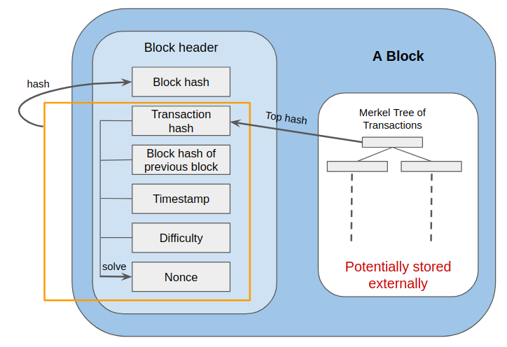
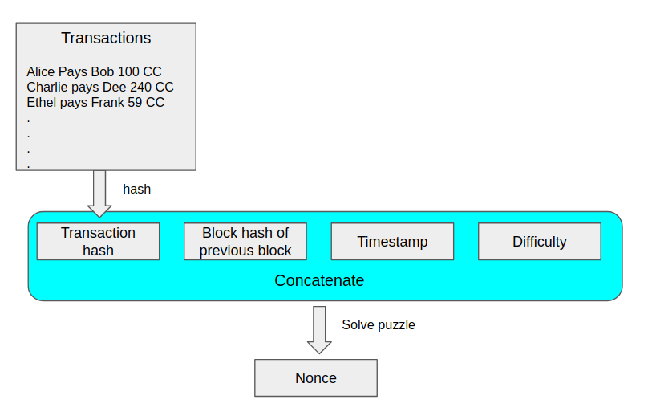
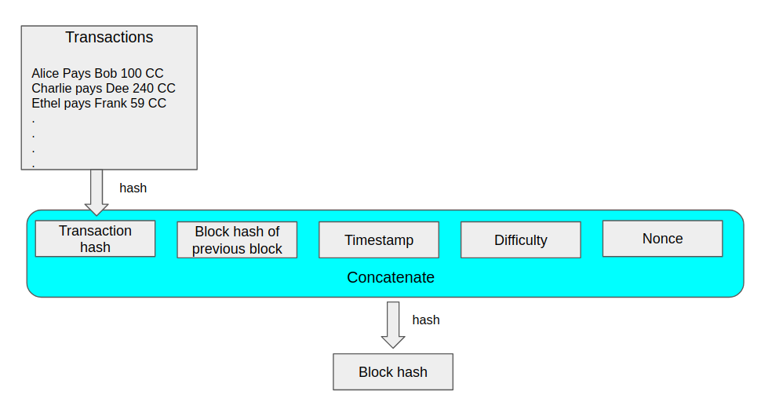
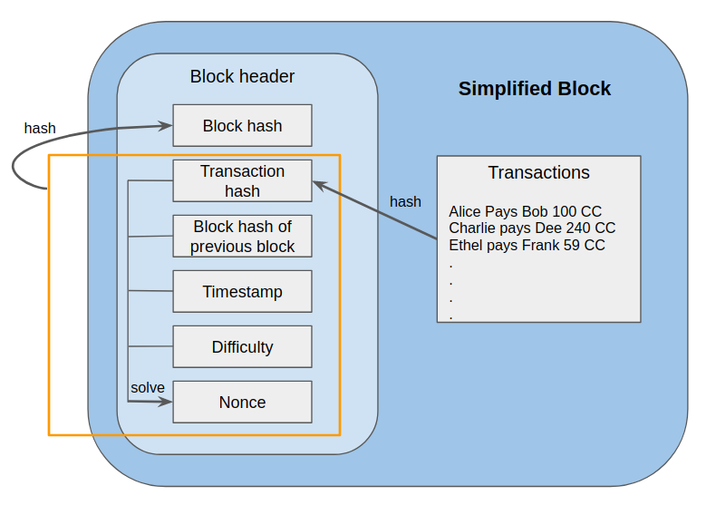
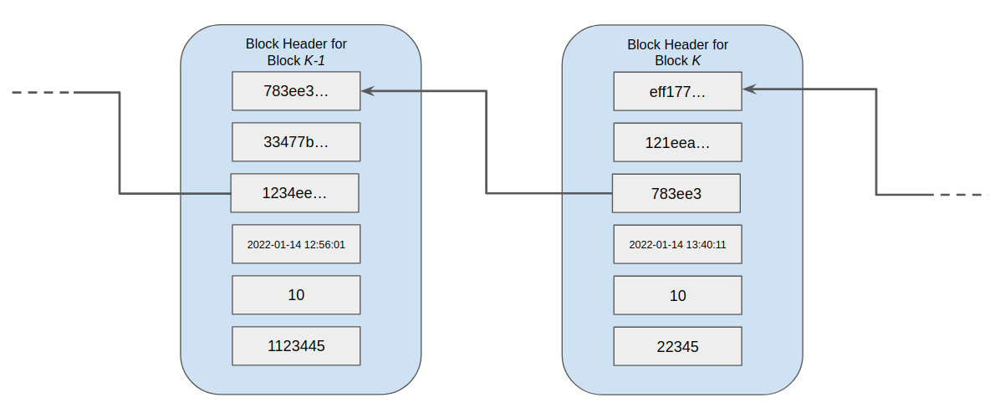
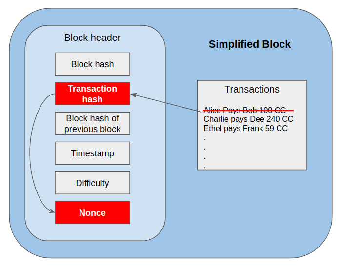

Copyright 2022 M. M. Hassan Mahmud


# The Blockchain Data Structure

Recall from the [Introduction](./bc_proto_quick_intro.md) that the term blockchain can refer to at least four different concepts, one of them being the core data structure that is used to implement distributed ledgers. In this article we look at this data structure.

As mentioned before, in a P2P distributed ledger each node has its own copy of the data that it can modify at will. So there needs to be mechanisms in place to ensure that all the nodes have a consistent view of the data. This view includes both the contents of the transactions and the order in which these transactions were executed. In the blockchain approach to distributed ledgers, this consistent view is maintained with the help of the blockchain data-structure and the [blockchain consensus algorithm](/bc_proto_consensus_algorithm.md). These two play off of each other to set up a protocol and incentive mechanism to ensure that the nodes are honest in terms of the contents and ordering of the transactions.

In particular, the blockchain data-structure ensures that

**A.**  It is computationally (see note below) very expensive to create it, with the cost increasing linearly with the size of the blockchain.

**B.**  It is computationally very expensive to modify transactions without violating certain consistency requirements, with the cost increasing linearly with the age of a transaction.

**C.** It is computationally cheap to verify that a structure is a valid blockchain data structure.

The full utility of these will be clearer after we have had a chance to study the consensus algorithm. However, we can already see that these properties together imply that once created, it will be very expensive to tamper with a blockchain without getting caught. Indeed, the difficulty can be adjusted as needed and the bigger the ledger, and the older a transaction, the more infeasible it becomes. These properties support the so called [Proof of Work](https://en.wikipedia.org/wiki/Proof_of_work) based consensus algorithm that we will discuss [later](bc_proto_consensus_algorithm.md). The proof of work here refers to the fact that the creation of the block encodes proof that a certain amount of work was carried out when creating the block. 

> Note: In general measures of cost other than computational cost can be used when constructing a blockchain, like reputation or stake in the consistency of the blockchain. These latter are particularly important from, for instance, a sustainability point of view and we discuss them [here](bc_proto_final_words.md). Consensus algorithms based on that are variously called called Proof of Reputation or Proof of Stake based consensus. 

At a high level, the blockchain is a [linked list](https://en.wikipedia.org/wiki/Linked_list) where each item in the list is _block_. The link to the next block in the chain is encoded using the contents of the current block and the next block using hash functions. It is this encoding that helps in maintaining the properties above. 

In the following we first describe what is contained in each block and then describe how these blocks are chained together. Along the way, we use our python-esque pseudocode to make the ideas concrete, and refer to python implementations of the same ideas for detailed self-study later on.

## Blocks

The purpose of a block is to store a set of transactions, their ordering, and some additional information to ensure properties **A** to **C**. Each block holds the same number of transactions, and this number is a application level parameter. The transactions within a block are ordered.  The intra-block ordering and the ordering of the blocks in the blockchain determine the ordering of the transactions in the ledger as a whole. At a high level, each block consists of two components (see _Figure: A Simplified Block_):

1. a block header. 
2. the transactions in the block

The block header, in turn, contains

1. the block id
2. pointer to the transactions in the block
3. pointer to the previous block in the chain
4. timestamp for the block creation.
5. the difficulty level of the [cryptographic puzzle](./bc_proto_prelim.md#cryptographic-puzzles) used to create the block
6. a nonce/solution to the cryptographic puzzle


We quickly define each of the elements in turn. The block id is in the form a _block hash_ a string that uniquely identifies the block and is also a [thumbprint](./bc_proto_prelim.md#uniqueness-of-hash-functions) of its contents. The pointer to the transactions is the hash-string of the root node of a Merkel tree (see below)  used to store the transactions in a block (this is the [next article](./bc_proto_merkel_tree.md) in our sequence). The pointer to the previous block is the block hash of the previous block in the chain. The timestamp is just a standard timestamp showing date time upto micro-second. We define how the nonce and the difficulty levels are when we describe how the block is created. 
 
We now describe how a block is created.


<p align="center">
  
</p>
<p align="center"><b> Figure: A Block in a Blockchain.</b></p>


### The Simplified Block

As we mentioned above, the transactions in a block are stored in a Merkel tree. This is an interesting data structure in its own right and requires a separate article to explain properly. So in this article we will look at a simplified version of a block  where instead of a Merkel tree we use an array to store the transactions. The pointer to the transactions will be a hash of a concatenation of the elements of this array. We discuss Merkel trees and full version of the block in the [next article](./bc_proto_merkel_tree.md).

The following pseudocode illustrates this simplified block definition:
```C
struct BlockHeader:
    block_hash: str
    transactions_hash: str
    prev_block_hash: str
    timestamp: DateTime
    difficulty: nat
    nonce: str


struct BlockSimple:
    block_header: BlockHeader
    transactions: [str]
```
We now look at how this simplified block is created.

### Creating a Simplified Block

The pseudocode for the creation is given below, and a  python implementation is [here](../blockchain_proto/block_creator.py#L84). 
```python
def create_block(transactions: [str],
                 prev_block_hash: str,
                 difficulty: nat) -> Block:

    trans_hash = get_trans_hash(transactions)
    timestamp = get_cur_time()
    nonce = solve_block_puzzle(trans_hash, 
                               prev_block_hash, 
                               timestamp,
                               difficulty)
    block_hash = create_block_hash(trans_hash,
                                   prev_block_hash,
                                   timestamp,
                                   difficulty
                                   nonce)
    new_block_header = BlockHeader(block_hash,
                                   trans_hash,
                                   prev_block_hash,
                                   timestamp,
                                   difficulty,
                                   nonce)
    return BlockSimple(new_block_header, transactions)
```
The `create_block()` expects the list of transactions, the hash of the previous block, and the difficulty level as inputs. The previous block hash will be some fixed string if the block is the first in the chain. 

The first line of the code creates a hash of the transaction by calling a function and this looks looks like the following:
```python
def get_trans_hash(transactions) -> str:
    return hash(concatenate(transactions))
```
This concatenates all the transactions in the list and then hashes the concatenated string to get the final transactions hash.

The second line of `create_block()` gets the current timestamp by calling a standard library function.

The third line of `create_block()` calculates the nonce for a cryptographic puzzle and it looks as follows:
```python
def solve_block_puzzle(trans_hash: str, 
                       prev_block_hash: str, 
                       timestamp: DateTime, 
                       difficulty: nat) -> str:

    puzzle_string = contatenate(trans_hash, 
                                prev_block_hash, 
                                str(timestamp),
                                str(difficulty)
                                )
    return solve_puzzle(puzzle_string, difficulty)
```
The first line of the `solve_block_puzzle()` creates a _puzzle string_ which is a concatenation of the transactions hash, the previous block hash and the timestamp converted to a string. The second line then calls the function defined [here](./bc_proto_prelim.md#cryptographic-puzzles) to get the solution to the puzzle string and returns it. Some authors call the puzzle string the _preliminary block header_ which to me seems like incorrect terminology. Regardless, _this puzzle string will form the basis of guaranteeing that properties **A** - **C** are maintained_. 
> Hence, this step is the **proof of work** that is created when creating a block. This is also what is meant by **mining a block**, a term which you likely have read/heard about often.

This process is illustrated in Figure: _Create Nonce_.

<p align="center">
  
</p>
<p align="center"> <b> Figure: Creating Nonce</b> </p>


Continuing on with `create_block()`, the fourth line of the function creates the block hash by calling `create_block_hash()`. This function is quite straightforward.
```python
def create_block_hash(trans_hash: str,
                      prev_block_hash: str,
                      timestamp: DateTime,
                      difficulty: nat # nat is the type of natural numbers/positive integers
                      nonce: str) -> str:
    block_data_string = contatenate(trans_hash, 
                                    prev_block_hash, 
                                    str(timestamp),
                                    str(difficulty),
                                    nonce)
    return hash(block_data_string)
```
It simply concatenates all the inputs, which consists of all the data in the block header, except for the block-hash, into a single string and creates a hash of that. So the block-hash serves as the thumbprint of the data in the block header. Since the block header also contains the hash of the transactions, the block hash serves as a thumbprint of the block as a whole, and also its id. This is shown in Figure: _Create Block Hash_

<p align="center">
  
</p>
<p align="center"> <b>Figure: Create Block Hash </b> </p>


The last two lines of `create_block()` creates the block header and the block by calling the respective constructors, and then returns the created block. The final created simplifed block is illustrated in Figure: _Simplified Block Creation Summary_.

<p align="center">
  
</p>
<p align="center"><b> Figure: Simplified Block Creation Summary.</b></p>

## The Blockchain Data Structure

In this section we look at how we can chain together a set of blocks so that _any tampering with the data in one of the blocks is EITHER very difficult OR can be detected very quickly_. This will turn out to be, in essence, the blockchain data structure. Indeed, the blockchain is meant to be an immutable structure and only addition operations are supported. In the following, we first discuss how to add transactions (and hence blocks) to the blockchain and then how tampering (removing or altering blocks/transactions) is made difficult. 

### Data Structure Components

The blockchain data structure consists of
1. the hash of the latest block in the chain,
2. a dictionary/map that maps block hashes to blocks
2. a set of transactions that has not been added to the block as of yet
3. a constant parameter indicating the number of transactions per block.
4. A difficulty level for the blockchain data structure

This is illustrated in the pseudocode below.
```C
struct Blockchain:
    latest_block_hash: str
    block_hash_to_block_map: dictionary{str -> BlockSimple}
    current_transactions: [str]
    trans_per_block: const nat
    difficulty: nat

```
The length of `current_transactions` must always be less than `trans_per_block`. Our python implementation of the blockchain data structure can be found [here](../blockchain_proto/blockchain_ds.py). 

> The attributes in the implementation are not quite one-to-one with the above data structure. This is because in a practical implementation we need to deal with some complications that arise primarily from forking (see below) and transactions and blocks arriving out of order. These complications get in the way of getting the core ideas across and are ignored here. However, these are discussed in detail [here](./bc_proto_running_blockchain.md).

### Initialization

Initializing the blockchain data structure is very simple.

```python
def init_blockchain(trans_per_block: nat, difficulty_level: nat):
    return Blockchain(latest_block_hash = NULL, 
                      block_hash_to_block_map={}, 
                      current_transactions=[], 
                      trans_per_block=trans_per_block,
                      difficulty_level=difficulty_level)
```
The latest block hash is set to NULL, the block hash to block map is set to the empty dictionary/map, the set of current transactions is set to the empty list, and the transactions per block and difficulty level are set to user defined parameters.

### Adding A New Block

A new block is added to the chain as part of adding a new transaction to the blockchain. The pseudocode below describes this.

```python
def add_transaction(bc: Blockchain, transaction: str) -> BlockSimple:
    append(bc.current_transactions, transaction)
    if length(bc.current_transactions) < bc.trans_per_block:
        return NULL

    # time to create a new block    
    new_block = create_block(bc.current_transactions, 
                             bc.latest_block_hash, 
                             bc.difficulty)
    bc.block_map[new_block.block_header.block_hash] = new_block
    bc.latest_block_hash = new_block.block_header.block_hash
    bc.transaction_list = []
    return new_block
```
The incoming transaction is first added to the the blockchain's list of transactions. After that if the length of the the current transaction list is equal to the `trans_per_block` parameter, a new block is added. 

The new block is created by using the function `create_block()` that was introduced above. Once this new block is created, the `block_hash_to_block_map` and the `latest_block_hash` attributes of the block are updated to, respectively, include the new block and set to the block hash of the latest block. Finally, the `current_transactions` of the blockchain is reset to the empty list. 

The figure below illustrates this 
<p align="center">
  
</p>
<p align="center"><b> Figure: The blockchain structure created.</b></p>


In the following we discuss how the above data structure resists tampering.

## Tampering is Detectable or Expensive

Consider what happens if an unscrupulous actor tries to modify the blockchain for their own benefit by tampering with the data in the blockchain. That is, the actor changes one or more of the following
- content of one of more transactions in a block
- the ordering of the transactions within a block 
- the timestamp of one or more blocks
- ordering of the blocks (by changing the previous block hash of one or more block headers)

By the [uniqueness of the hash functions](./bc_proto_prelim.md#uniqueness-of-hash-functions), since all of these go into creating the block hash in `create_block()`, re-computing the block hash (which is not expensive) will immediately reveal the tampering. So any kind of simple attempt at tampering is detectable.

A slightly less simple way to tamper would be to recompute the block hash using the tampered data, and then update the block hash for the block(s) as well after tampering. However, this can also be detected cheaply calculating the puzzle string in  `solve_block_puzzle()` and checking that the nonce in block [solves this puzzle](./bc_proto_prelim.md#cryptographic-puzzles) for the difficulty level included in the block. As discussed in the linked article, any tampering will result in the nonce failing the check. _Figure Transaction Tampering Flow_ illustrates how tampering with a single transaction impacts the nonce and hence makes it detectable - compare this with _Figure Simplified Block_

<p align="center">
  
</p>_
<p align="center"><b> Figure: Tampering With A Single Transaction.</b></p>


So to tamper with a single block in an undetectable way, our tamperer would need to recalculate the nonce as well, which is very computationally expensive (with the expense determined by the difficulty of the puzzle). So essentially, the tamperer would need to create a new block by calling `create_block()` and then replace the current block with the new block.

However, troubles for our tamperer does not end here. This new block would have a different block hash, which would be linked to the next block in the chain via the `prev_block_hash` of the latter. This means that the tampering would be detected by traversing the chain when the `prev_block_hash` of the next block would point to a non-existent block. To fix this, the `prev_block_hash` would need to be changed and, by the same arguments as above, the preceding block would also have to be recreated. Indeed this process would need to be repeated until the newest block in the chain. 

To summarize:

>**To tamper with a single transaction in a single block in an undetectable way, all the blocks from that block to the newest block will have to be recreated, which makes tampering extremely expensive. And all this together, ensures properties **A** to **C** of a blockchain.**

The pseudocode below shows the logic for verifying a blockchain and detecting any tampering that we just discussed. 

```python
def validate_puzzle(bh: BlockHeader, trans_hash: str) -> Bool:
    puzzle_string = concatenate(trans_hash, 
                                bh.prev_block_hash, 
                                str(bh.timestamp),
                                str(bh.difficulty))
    return check_solution(puzzle_string, 
                          bh.difficulty,
                          bh.nonce)

def validate_block_hash(bh: BlockHeader, trans_hash: str) -> Bool:
    test_block_hash = create_block_hash(trans_hash,
                                        bh.prev_block_hash,
                                        bh.timestamp,
                                        bh.difficulty,
                                        bh.nonce)
    return test_block_hash == bh.block_hash 
        

def validate_chain(bc: Blockchain) -> (Bool, str):
    next_block_hash = bc.last_block_hash
    block_count = 0

    while next_block_hash !=  NULL:

        block = bc.block_map[next_block_hash]
        if block is NULL:
            error_message = "Block not found for block hash: " + next_block_hash
            return (False, error_message)

        trans_hash = create_trans_hash(current_block.transactions)
        if not validate_puzzle(block.block_header, trans_hash):
            error_message = "Nonce invalid for block with block hash:" + 
                           block.block_hash
            return (False, error_message)

        if not validate_block_hash(block.block_header, trans_hash):
            error_message = "block hash is invalid: " + block.block_header.block_hash
            return (False, error_message)

        next_block_hash = current_block.prev_block_hash

        # increment block count for validation later
        block_count = block_count + 1

    if block_count != length(bc.block_hasht_to_block_map):
        error_message = "Chain traversal did not reach all the blocks"
        return (False, error_message)

    return (True, "Validation successful")
```
The python implementation for this is a bit more complicated, but can be found [here](../blockchain_proto/block_creator.py) and [here](../blockchain_proto/fork_manager.py). However, [this](./bc_proto_running_blockchain.md) should be read prior to studying that code. 

### Sidebar: Difficulty of Puzzles In Bitcoin

Since bitcoin is the most well known example of a blockchain, it is worth mentioning that the difficulty parameter for creating a block is dynamically adjusted rather than kept at a fixed value. This design decision was made because bitcoin was conceived as a crypto-currency rather than a generic blockchain. By dynamically adjusting the difficulty it can be ensured that about one block was mined by the whole network every ten minutes. The reasons for this was to trade off network stability vs. time to confirm a transaction has been added - see [here](https://bitcoin.stackexchange.com/questions/1863/why-was-the-target-block-time-chosen-to-be-10-minutes) for a detailed discussion of why. 

Additionally, the reward in terms of bitcoins for creating a block, (discussed in [this article](./bc_proto_consensus_algorithm.md) in this series) also decreases over time to ensure that there are 21 million bitcoins ever created. This number, the actual value being somewhat arbitrary, was selected to help prevent inflation so that no one can just 'print money'.


### Final Words

The above description covers all the core ideas relevant to the blockchain data structure. However, as pointed out earlier, implementing this for a working distributed peer to peer system is generally much more challenging. This is largely because the nodes behave asynchronously, messages get delayed or dropped and so on. We handle some these issues in our implementation but not all. These are further discussed [here](./bc_proto_running_blockchain.md).
