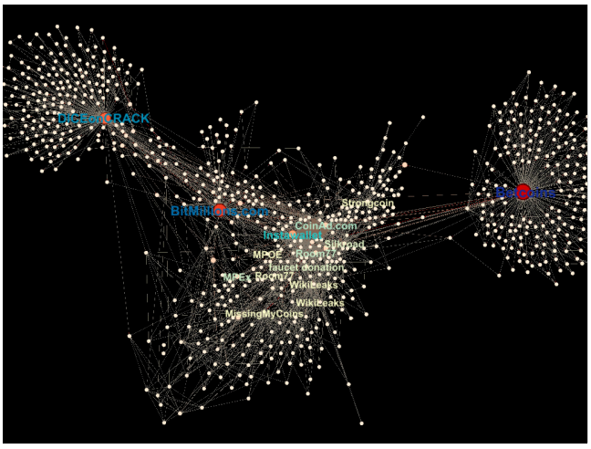
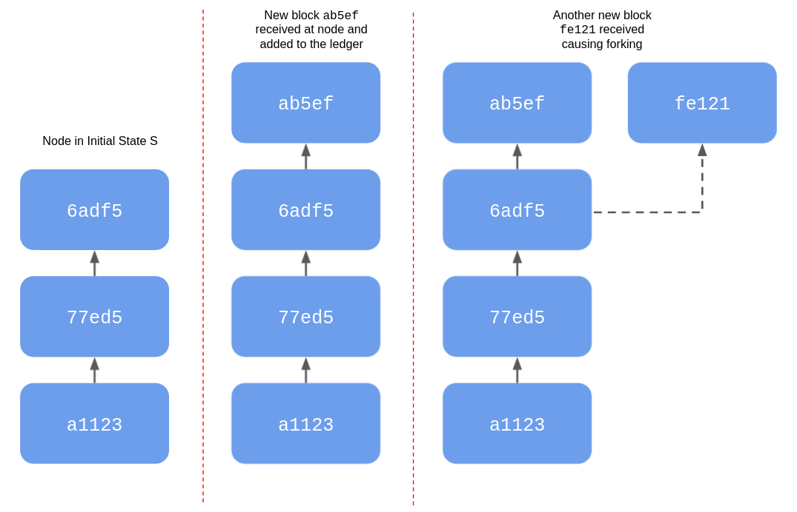

Copyright 2022 M. M. Hassan Mahmud


# The Blockchain Consensus Algorithm

One of the properties that make the blockchain technology so attractive is that any node/peer within the chain can create a transaction at any point in time and add it to the ledger. But because there is no central authority coordinating the work of the peers, the challenge now is to ensure that all the peers have a consistent view of the ledger. That is, ensure that all the nodes agree on what transactions are in the ledger and what order the transactions were performed in. This is called the *blockchain consensus problem* and one of the main innovations of the blockchain technology is an algorithm or protocol that helps solve this. The particular consensus algorithm we look at is often called the Proof of Work based consensus algorithm. This is because for this algorithm requires each node to demonstrate that it has expended a certain amount of computational resource before it can add a block to the chain. This expenditure in turn is shown by [solving the puzzle](./bc_proto_blockchain_ds.md#creating-a-simplified-block) when creating the block. 

Indeed, the [consensus problem](https://en.wikipedia.org/wiki/Consensus_(computer_science)) is a general problem that shows up in all distributed systems applications and is considered to be very difficult to solve. Many different solutions have been proposed in the past and these have complementary strengths, and are applicable for different use cases. Which is another way of saying that no general solution to the consensus problem exists. The blockchain consensus algorithm in particular solves this problem for distributed ledgers by answering the following questions for each node:

1. How to communicate transactions carried out at the node and receive transactions that have been carried out at the other nodes.

2. How to create a new block using the new transactions and communicate that block to other nodes.

3. What to do when other nodes sends blocks to be added.

4. When and which blocks to add to the local structure and in what order.

We address each of the above issues in turn from the perspective of a single node, and describe what it means in terms of the overall state of the distributed ledger. We begin by introducing some key high level ideas that make it all hang together.

## Incentivizing Accuracy and Honesty

One of the key ideas in the blockchain algorithm is that of rewarding nodes that help in maintaining a correct and consistent view of the blockchain. A reward scheme is necessary because there is no central authority to force/ensure that the nodes are not misbehaving.

This reward typically takes the form of fees paid by the nodes that want a transaction stored in the blockchain but can take other forms as well. The fees themselves may be paid using a *token* native to or unique to the blockchain platform, which can in turn be obtained by buying said token in some kind of exchange. However, there are often other forms of reward schemes as well. For instance in the bitcoin protocol, the blockchain that that started it all, the reward is in the form a [certain units of the bitcoin cryptocurrency](https://en.wikipedia.org/wiki/Bitcoin_network#Mined_bitcoins).

The exact form of the reward is not important - what is important is that there *is* a reward in helping maintain the blockchain structure and the reward *is* sufficient to incentivize the nodes in spending the effort necessary for maintenance. For instance, for bitcoin, the initial incentive for maintaining the network and earning coins was the anticipation that bitcoins will increase in value in the future (which has certainly [borne out](https://coinmarketcap.com/currencies/bitcoin/) as of writing this document). 

> This last example *should not* be considered to be an endorsement of investing in any cryptocurrency.

In the following we will not explicitly show this reward mechanism in pseudocode or implement it in our python code as it takes a fair bit of time to do it right. However, if you want to see it here, please feel free to submit a pull request with the necessary changes! 


## Blockchain Consensus Algorithm Main Loop

Now that we know about rewards, we can define the main loop of the consensus algorithm that runs in a single node and justify why it works. In the main loop, the algorithm is in one of the two following phases:

**A.** Trying to create and add the next block in the chain in competition with the other nodes in the chain.

**B.** Validating and adding to the blockchain a new block that has been created and submitted by a peer.

Both of the phases are motivated by the reward scheme that was mentioned in the previous section. Phase A is motivated by the fact that if a node manages to create the next valid block before everybody else, it will receive the associated reward. Phase B is motivated by fact that if a node can prove that the submitted block is not valid, it can continue working on creating the next block and getting the reward for it. Or alternatively if the block is valid, it can get a head start on starting phase A for the next block.

Phase A for each node consists of the following steps:

1. Receive and validate transactions from connected peers or create transactions at the current node as per user request.

2. Once sufficient number of transactions have been received, create a new a block using the transactions and send the new block to peers.

Phase B for each node consists of the following steps:

1. Upon receiving a new block ensure that it is a valid block using the logic described in [The Blockchain Data Structure](./bc_proto_blockchain_ds.md).

2. If the requested block is valid, then add it to the local blockchain structure (taking care of any forks - see below) and inform the connected peers about the addition of this new block.

So the overall algorithm be described as follows (in a python like pseudocode)

```python
TRANS_PER_BLOCK = 8

def blockhain_consensus(bc: Blockchain,
                        ext_trans: [str],
                        node_trans: [str],
                        new_external_blocks: [str]):
    while True:
        # wait until there are transactions or blocks to process
        while length(ext_trans) + length(node_trans) + length(new_external_blocks) < 0:
            wait() 

        invalid_trans = []
        for trans in concatenate(ext_trans, node_trans):
            if validate_transaction(trans):
                communicate_transaction_to_peers(trans)
                created_blocks = add_transaction(bc, trans)
                if created_blocks is not null:
                    communicate_new_blocks_to_peers(created_blocks)

        # check if any new block has been received and process them
        for block in new_external_blocks:
            if validate_block(blockchain, block):
                add_external_block(blockchain, block)
                communicate_new_block_to_peers(block)

```
The algorithm runs in an infinite loop (`while True:`)and receives four references as arguments: to the blockchain (`bc`), to a list of transactions from other peers (`ext_trans`), a list of transactions performed at the current node (`node_trans`) and a list of new blocks received from peers (`new_block`). All the lists get filled by separate processes running in parallel. 

The algorithm waits until there are transactions or blocks to process. If there are new transactions, these are added the blockchain one by one in the first `for` loop. For each transaction, it is first validated (again, see below), and if the transaction is valid, it is communicated to the peers of the node and added to the blockchain. Adding a transaction may trigger the creation of a new block. If a block is created it is communicated to the peers of this node(see below). 

In the second for loop, the queue of new blocks is iterated through and all the blocks in the queue are validated and added to the chain. 


## Creating and Communicating Transactions

As we mentioned above, transactions can be created by any node in the blockchain. However any transaction created by the system must be valid in a certain sense. First, it has to pass the proper authorization requirements in the ledger, and second it has to be valid in terms of the other transactions in the blockchain. We discuss each issue in turn.

### Authorizing a Transaction

When a distributed ledger is used to record transfer of some ownership of some item (land, jewellery, guitar - take your pick) between users, it is often protected using [public-key cryptography](https://en.wikipedia.org/wiki/Public-key_cryptography) so that the transfer from user A to any other user is [digitally signed](https://en.wikipedia.org/wiki/Digital_signature) by A's _private key_. By digitally signing it, user A can ensure no can tamper with the contents of the transaction without the tampering getting detected.

> Since both public-key cryptography and digital signature are well known computer science concepts I will not discuss them in detail beyond the links.

For example a transaction may look like the following
```
{
  from: "0xEA674fdDe714fd979de3EdF0F56AA9716B898ec8",
  to: "0xac03bb73b6a9e108530aff4df5077c2b3d481e5a",
  fee: "2",
  nonce: "43",
  title_name: "ad3843b887aabdcb49f36f9ef6bb1300c5bd4722"
}
```
The above was directly inspired by the transaction form at in Ethereum, which is documented [here](https://ethereum.org/en/developers/docs/transactions/). In our example the fields have the following meaning:  
- `from`: the current owner,  digitally identified by their [public key](https://en.wikipedia.org/wiki/Public-key_cryptography)
- `to`: the new owner, also identified by their public key
- `fee`: the fee to be received by the node that successfully creates the block for this transaction (see below).
- `nonce`: this is the number of transactions from the `from` user that has been added to the blockchain so far + 1. This is to id this transaction specifically, and prevent double transfers (transferring the same item to multiple users). Note that this is another `nonce`, different from the one we discussed [before](./bc_proto_blockchain_ds.md#Blocks). We will discuss this more below.
- `title_name`: a digital id of the object whose ownership is being transferred.

The digital signature for this transaction is created by the `from` user node by (roughly speaking) hashing the string corresponding to the transaction and then digitally signing the hash using `from`'s private key . The signature can then be verified by using the `from` user's public key (which is also their id). This way we can be sure that transaction was authorized by the `from` user.

### Validating A Transaction

Depending on the nature of the items in the blockchain, several different kinds of validation may need to be performed. In the example above we need to ensure that the `from` user actually owns the item in question by looking at the history of the blockchain and noting that an accepted block records `from` user gaining ownership of the item (there may need to be special 'verified ownership' type transactions to initialize the chain with a user owning a particular item - but we don't address those complications here).

We also need to ensure that the same transaction is not written into the blockchain more than once (in the same or different block). This can be done only accepting transaction into a block if another transaction with nonce exactly one less has already been accepted into the blockchain - which ensures the correct sequencing of the transactions for each user. One further check that needs to be performed is ensuring that a transaction that has been received is not already in the list of yet to be added transactions.

### Communicating Transactions

When a node creates a transaction it ensures that it has been properly authorized and it is valid. It performs the same operation when it receives a transaction from another node. In both cases once a transaction has been properly authorized and validated, it is communicated to the rest of the blockchain using the [gossip protocol](https://en.wikipedia.org/wiki/Gossip_protocol). In this protocol, each node periodically sends all the peers it knows about an updated list of the new transactions that has occurred in the node itself and the new transactions it has received, which have not been accepted into a block yet. That's all there is to it. This may also include checks to ensure that a transaction is not communicated to 

Of course, each node also needs to perform the necessary functions to ensure that it remains connected to the peer to peer network of the blockchain - this includes
- connecting to the peer to peer network itself by querying one or more trusted servers to identify peers that the node can connect with
- pinging peers to determine if an existing connection is still valid
- retrieving list of additional peers from current peers that the node can connect to.

The number of connections has to trade off between being reliably connected to the peer to peer network for using it and ensuring its proper functioning vs. flooding the network with too much traffic. However, these are standard issues in peer to peer network design and not specific to blockchains - and so I won't discuss them further here.


## Creating and adding a new block

Once a node has received a sufficiently many new transactions it begins the process of adding a new block. We went through the detail of how this is done in part [Blockchain Data Structure](./bc_proto_blockchain_ds#blocks) and will not discuss them further here. Once added, the block is sent to the peers the node is connected to via the gossip protocol again. The code for this can be found [here](todo).

## Receiving a new block

The distributed nature of the blockchain makes processing the receipt of a new block a potentially tricky affair. The problem arises from the fact that it is possible (and it does happen in practice) that different parts of the network, developing independently, may have come to different views of the order in which blocks were added. So this means that the blockchain structure at the local node is different from the one declared in the block that was received (i.e. its previous block hash is not the latest block hash in the blockchain). This is called *forking* of the blockchain. We first discuss how forking happens and then strategies for dealing with.

### Forking of a blockchain

Let us give an example of how forking may happen. Let us start with a case where the blockchain is at a consistent state `S` - that is all nodes agree on the order of blocks in the ledger. Nodes in real peer to peer networks tend to be clustered into groups, so that nodes within a group have fewer hops between each other. The following figure, taken from [2], shows this effect in an early version of the bitcoin network, where you can clearly see at least four different clusters.

<p align="center">
  
</p>
<p align = "center"><b> Figure: Bitcoin Network Topology.</b></p>

So what may happen is nodes within a cluster, say cluster `A`,  may create enough new transactions to constitute a new block. Furthermore, because of the use of the gossip protocol these may be communicated to  a single node `N` in cluster `A` before the same can happen at any other node outside the `A`. `N` may then create a new block with block hash (shortened) `ab5ef` and communicate that to the blockchain. By a similar process some other node `M` may also create a new block with block hash (shortened) `fe121` with possibly a different set of transactions and also communicate that to the rest of the blockchain. Because of this some peers will think the blockchain is `S` followed by `ab5ef` and others  will think the chain is `S` followed by `fe121`. A particular node will only know this when it receives both new blocks at some point. Hence the blockchain has _forked_. The figure below illustrates this.

<p align="center">
  
</p>
<p align = "center"><b> Figure: Forking Example.</b> </p>

A blockchain may also be forked intentionally to, for instance, upgrading to a different version of the software etc. This is a vast topic in and of itself - the [Wikipedia article](https://en.wikipedia.org/wiki/Fork_(blockchain)) is a potential starting point for further research.


### Strategies for dealing with forking

Forking means that different nodes in the blockchain will have a different view of the ledger which defeats the whole point of a ledger. Hence, the nodes need to have a protocol to decide what the correct order of transactions is. The main principle that is used to decide among different branches is the following:

>**choose the branch that represents the most amount of work by the peers**

That is, the creation of each block represents a certain amount of computational effort required to solve the puzzle (but not always - see [here](bc_proto_conclusion.md)), and the amount of computational effort in a branch is the sum of the computational effort in each block in the branch.

For instance, if the  computational effort in the creation of each block is the same, then the _longest branch_ is the one that each node would choose as the correct view. Alternatively, if the puzzle solved in each block is of different difficulty, then a node would choose the so called _heaviest branch_ as the correct view.

The reader may wonder whether the above protocol guarantees that the nodes arrive at a consistent view of the blockchain. This is still a subject of on-going research, but the answer has been shown to be in the affirmative in certain restrictive cases [3, 4, 5]. In practice however, the longest chain approach rule seems to work - but, it is also important to be aware of this problem. 

One rule of thumb that is often used to not let forking disrupt use of the blockchain is as follows: a transaction is not considered to be part of the chain for validation purposes unless the block it is in is at least sixth from the latest block. This ensures that if a particular transaction is added to the chain, its relevant predecessors (via the `nonce` in the transaction) will have been accepted as valid by most of the nodes in the blockchain.

## Why Does the Consensus Algorithm Work?

Now that we have looked at all the pieces in a blockchain, its worth recapping everything and understanding how the blockchain data structure and and consensus algorithm work together to maintain a consistent view of the ledger across the peer to peer network. Indeed this is a question we raised in the [data structure article](./bc_proto_blockchain_ds.md) and this is a good time to circle back it.

Recall from the data structures article that the blockchain data structure ensures that it is very inexpensive to verify its correctness but very expensive to create and tamper with it in an undetectable way. We claim that this property + the reward mechanism that we described above + the algorithm works together to ensure the consistency of the blockchain. 

To begin with, because of the reward mechanism, all the nodes have the incentive to add blocks to the transactions as soon as possible. This ensures that the blockchain is always kept up to date. The main outstanding issue now is how consistency is ensured. We have already considered how this is done when honest nodes disagree on the order of the transactions in the section on forking. So we need to consider what happens when some node wants to tamper with one or more transactions and then wants the rest of the nodes in the blockchain to accept that tampering as the truth.

In this case, as discussed in [here](bc_proto_blockchain_ds.md#tampering-is-detectable-or-expensive), the tamperer will need to spend a lot of effort to recreate the blocks from the tampered block onward for the tampering to be undetectable. Now the next task for this tamperer will be to have the new blocks be accepted by the other peers. In particular, the tampered blockchain will represent a fork from the tampered blocks onward. Because of the rule for resolving forks discussed above, the tampering node will need to ensure that its chain also has the highest weight. Which means it will need to keep adding new transactions as new blocks itself, because the other nodes in the blockchain, will have kept adding those same transactions as new blocks to the untampered chain because of the reward incentive.  So this means, roughly speaking that the tamperer would need to have more resources available to it than the honest nodes in the chain to overwhelm the chain and have its tampering be accepted as the truth. This is very challenging if not impossible in a sufficiently large blockchain system. 

The above description is somewhat informal but I hope it gives the reader some intuition about why the consensus algorithm works. Proper formal analysis is challenging, and I recommend the reader consult the research literature on blockchain consensus algorithms for details. Some possible starting points for this are [4, 5].

## Conclusion

This concludes our presentation of the consensus algorithm. As the reader may suspect, a real life, full scale implementation of this in a deployed distributed ledger is a Herculean task because of the need to handle different exceptions and corner cases, ensure scalability, security, performance, flexibility, correctness and user-friendliness. This is a vast topic, and the interested reader has many months of exciting study of (a) the vast research literature on blockchain consensus protocols and (b) source code of established blockchains ahead of them. However, this brief article should have given them a starting point for further exploration. The [next article](bc_proto_running_proto_blockchain.md) describes our implementation of a proto-blockchain, which can also serve as a starting point for further exploration.


## References

[1] Drescher, Daniel. *Blockchain Basics: A Non-Technical Introduction in 25 Steps*. Apress, 2017, 1st ed. Edition

[2] Lischke, Matthias and Fabian, Benjamin. Analyzing the Bitcoin Network: The First Four Years. _Future Network_, 2016, Volume 8, Issue 7.

[3] Decker, Christian and Wattenhofer, Roger. Information propagation in the bitcoin network. IEEE P2P 2013 Proceedings. 2013, pages 1–10.

[4] Ferdous, Md Sadek and Chowdhury, Mohammad Jabed Morshed and Hoque, Mohammad A. and Colman, Alan. Blockchain Consensus Algorithms: A Survey. arXiv:2001.07091. https://arxiv.org/abs/2001.07091

[5] Garay, Juan A. and Kiayias, Aggelos and Leonardos, Nikos: Full Analysis of Nakamoto Consensus in Bounded-Delay Networks. IACR Cryptol. ePrint Arch. 2020.


<br>
<hr>

[Next Article: A Proto-Blockchain Implementation](./docs/bc_proto_implementation.md)
