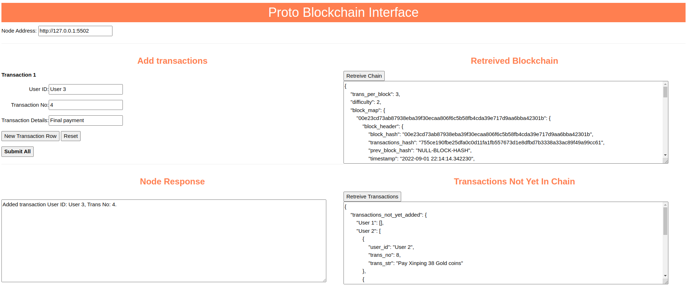

# A Proto-Blockchain Implementation

This section describes the implemenation of a "proto-blockchain" that can be found the folder `blockchain_proto` in this repo. The prot-blockchain gives concrete implementations of many of the ideas discussed in the documentation (and then some). But it lacks some crucial features such as the tokens, user authentication, Merkel trees, secure transfer etc. The feature set selected were chosen based on limited free time of the author and a desire to investigate the complications that arise from distributed nature of blockchains. Of course this is an open source repo, and if anybody wishes to do so they are welcome to contribute these missing features!

In the following we first describe how to run blockchain locally and give some hints regarding the implmentation. But other than that we leave the reader to discover the details of the implementation on their own. We have strived to document the code well, so hopefully that will be an interesting experience in and of itself.

All the commands below are run from a terminal in a linux-like or windows shell. I assume that you are familiar with `python` and already have an installation. 

## Installation

To install the repo create and activate a virtual environment by `cd`ing into your folder of choice and then (for instnace)
```bash
> virtualenv venv
> source venv/bin/activate
```
After that `cd` into the root folder of the repo and install the dependencies, and then the blockchain itself by:
```bash
(venv) >  pip install -r requirements.txt
(venv) > python setup.py install
```
if you think you want to play around with the code, replace the second comman with
```
(venv) > python setup.py develop
```
that's it!


## Running Nodes in the Blockchain

We now show how to run a simple test with two nodes. `cd` into the `blockchain_proto` folder and start the registry service for nodes by:
```bash
(venv) > python registry.py 6000
```
open another terminal tab, activate the virtual environment and then 

```bash
(venv) >  python node.py --base-port 5500 --registry-address localhost:6000  --trans-per-block 3 --user-id 1 --run-test
```

This will start a blockchain node which will expect other nodes to connect with it at 5500. Look at the messages it spits out to see the additional things its doing - it should look similar to the following:

```bash
2022-08-31 21:57:03 INFO: [Node 1] Registering node with registry at: localhost:6000
2022-08-31 21:57:03 INFO: [Node 1] Received address list [b'tcp://localhost:5500']
2022-08-31 21:57:03 INFO: [Node 1] Received new peer notify address list [b'tcp://localhost:5501']
2022-08-31 21:57:03 INFO: [Node 1] Notifying peers that "I'm online".
2022-08-31 21:57:03 INFO: [Node 1] Done notifying peers.
2022-08-31 21:57:03 INFO: [Node 1] **** Hello There! ****
2022-08-31 21:57:03 INFO: [Node 1] Local BC-Proto node is now running...
2022-08-31 21:57:03 INFO: [Node 1] Port: 5500, New-Peer-Port: 5501, Using registry at: localhost:6000
2022-08-31 21:57:03 INFO: [Node 1] Starting local interface node web-server http://127.0.0.0:5502.
2022-08-31 21:57:03 INFO: [Node 1] Use the 'local_interface_client.html' file to interface with the node.
```

Because of the `--user-id 1 --run-test` it will also run a test where it adds ten transactions to the blockchain using the local interface. The local interface is a web server/REST API interface that you can use to interact with the node (more on that below). The addition of the 10 transactions should result in console output of the followng form

```bash
2022-08-31 21:57:03 INFO: [Node 1] Local interface request recevied
2022-08-31 21:57:03 INFO: [Node 1] Adding transaction... User 1: [0] Pay Jamila 36 Gold coins
2022-08-31 21:57:03 INFO: [Node 1] Adding transaction... User 1: [1] Pay Asha 24 Gold coins
2022-08-31 21:57:03 INFO: [Node 1] Adding transaction... User 1: [2] Pay Asha 26 Gold coins
2022-08-31 21:57:03 INFO: [Node 1] Adding new blocks to the chain...
2022-08-31 21:57:03 INFO: [Node 1] Added: 1 blocks.
2022-08-31 21:57:03 INFO: [Node 1] Adding transaction... User 1: [3] Pay Jamila 37 Gold coins
2022-08-31 21:57:03 INFO: [Node 1] Adding transaction... User 1: [4] Pay Xinping 31 Gold coins
2022-08-31 21:57:03 INFO: [Node 1] Adding transaction... User 1: [5] Pay Bikash 43 Gold coins
2022-08-31 21:57:03 INFO: [Node 1] Adding new blocks to the chain...
2022-08-31 21:57:03 INFO: [Node 1] Added: 1 blocks.
2022-08-31 21:57:03 INFO: [Node 1] Adding transaction... User 1: [6] Pay Bikash 23 Gold coins
2022-08-31 21:57:03 INFO: [Node 1] Adding transaction... User 1: [7] Pay Bikash 43 Gold coins
2022-08-31 21:57:03 INFO: [Node 1] Adding transaction... User 1: [8] Pay Asha 43 Gold coins
2022-08-31 21:57:03 INFO: [Node 1] Adding new blocks to the chain...
2022-08-31 21:57:03 INFO: [Node 1] Added: 1 blocks.
2022-08-31 21:57:03 INFO: [Node 1] Adding transaction... User 1: [9] Pay Jamila 27 Gold coins
2022-08-31 21:57:03 INFO: [Node 1] Local interface request recevied
2022-08-31 21:57:03 INFO: [Node 1] Returning Un-added transactions {"transactions_not_yet_added": {"User 1": [{"user_id": "User 1", "trans_no": 9, "trans_str": "Pay Jamila 27 Gold coins"}]}}.
```

Open another tab, activate the virtual environment and start another node by:
```bash
(venv) >  python node.py --base-port 5504 --registry-address localhost:6000  --trans-per-block 3 --user-id 2 --run-test
```
> NOTE: Their `--base-port` arguments for different nodes must be at least `3` different from each other as each node uses the three successive ports for different purposes.

When you start this new node, the console output should be similar, but you should also see 
```bash
2022-09-01 21:51:55 INFO: [Node 1] Received address list [b'tcp://localhost:5500']
2022-09-01 21:51:55 INFO: [Node 1] Received new peer notify address list [b'tcp://localhost:5501']
2022-09-01 21:51:55 INFO: [Node 1] Connecting to peer tcp://localhost:5500
2022-09-01 21:51:55 INFO: [Node 1] Notifying peers that "I'm online".
2022-09-01 21:51:55 INFO: [Node 1] Sending I am online to tcp://localhost:5501
```
and also 
```
2022-09-01 21:51:55 INFO: [Node 1] Adding 3 blocks from peer.
2022-09-01 21:51:55 INFO: [Node 1] Adding 1 transactions from peer.
```
which shows that the new node has connected to the older node and added transactions and blocks from that node. The next section will show how to interface with these nodes and see that both nodes are now in sync.

## The Local Interface

The local interface can be started by opening the file `local_interface_client.html`. You will need to have one instance of this open per client. This interface is fairly basic and lets you add transactions to a node, retrieve the blockchain stored in the current node and the unadded transactions in the current node.

<p align="center">
  
</p>
<p align = "center"><b> Figure: The Local Interface</b></p>


To interface with a node, enter the address given when the node started:
```
2022-08-31 21:57:03 INFO: [Node 1] Starting local interface node web-server http://127.0.0.0:5502.
```
in the box in the top left corner. 

To retreive the blockchain click on `Retreive Blockchain` button on the right - to retrieve the un-added transactions click on `Retreive Transactions`

You can submit new transactions to the local interface by using the form on the right. The only restriction here is that the Transaction no. field should be an integer (and the other restrictions associated with blockchain). Transaction numbers for a user start at `0`. Whenever you submit transactions to a node, they should show up in the other node as well, which you can retreive from the other node by clicking on `Retrieve Transactions`.


## Implementation Hints

The following are some hints that should get you started in understanding the code base.

- The code that implements the blockchain, forks and transactions are in `blockchain_proto/blockchain`, `blockchain_proto/fork`, `blockchain_proto/transaction` respectively.
- The blockchain structure we describe in this documentation is maintained via the code for the blockchain and forks. It turns out implementing a blockchain in the presence of forks is far more subtle than when viewed from a conceptual level. It is very useful to study this aspect.
- The peer to peer communication is implemented using the [zmq](https://zeromq.org/) library - consult the guide to understand this was implmented.


