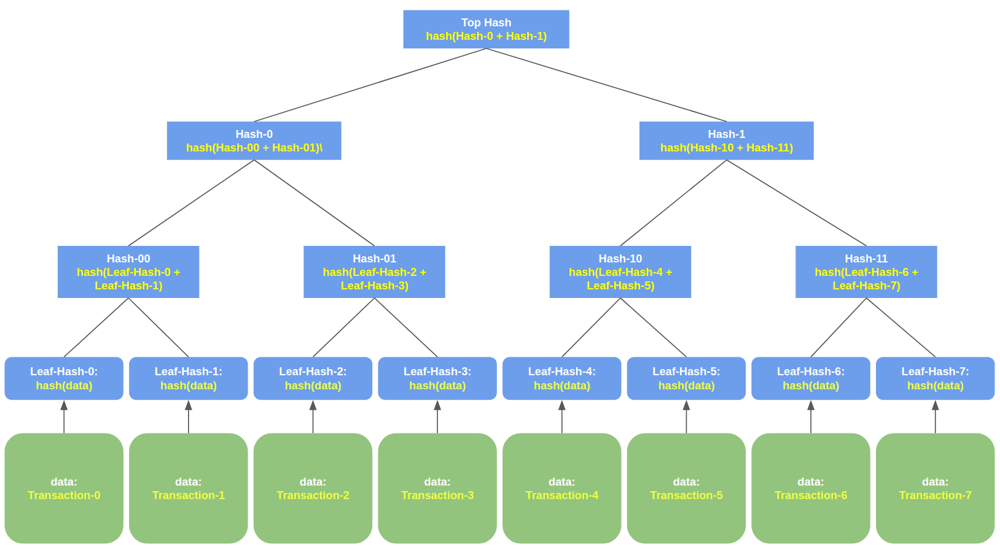
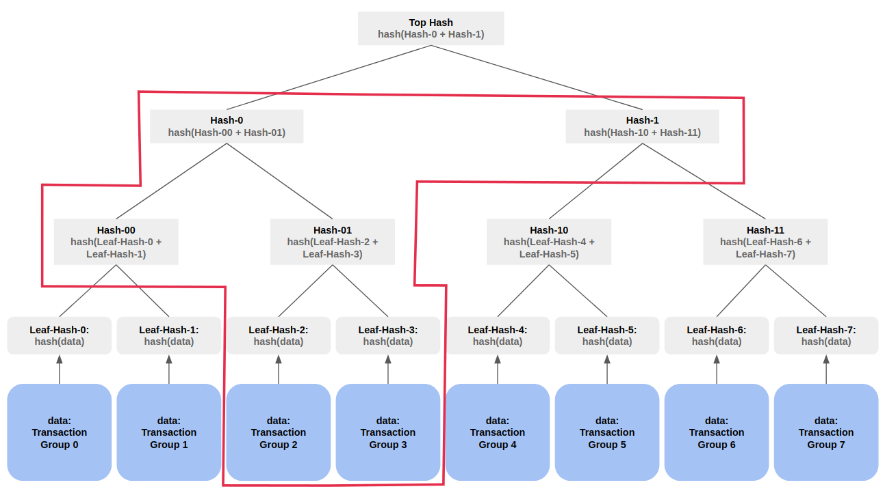

# Merkel Tree

## Introduction

In [Blockchain Data Structure](./bc_proto_blockchain_ds.md) we stored the transactions as an array. However, typically a block may contain a large number of transactions and storing them as an array can become very inefficient as the blocks, often large numbers of them, need to be shared between peers/nodes in the blockchain. Because of this transactions are stored using a [Merkel tree](https://en.wikipedia.org/wiki/Merkle_tree) data structure which allows one to represent a large number of transactions using a single hash in such a way that it is possible to verify quickly whether a transaction belongs to set that the Merkel tree represents. This way, the blockchain need only store the Merkel tree hash, and download transacitons in a trusted from some external server as needed. 

## An Example

The merkel tree structure for a set of 8 transactions is given in the figure below and illustrates the basic ideas.

<p align="center">
  
</p>
<figcaption align = "center"><b> Figure: Merkel Tree Example</b></figcaption>


The tree itself consists of the grey boxes and stores the 8 different transactions - the blue boxes - via their hashes. The transactions do not form part of the tree. The tree is always a [binary tree](https://en.wikipedia.org/wiki/Binary_tree). Each leaf contains the hash of a single block of data (not to be confused with a blockchain block!) which may be a group of transactions or a single transaction. The hash of any internal node is the hash of the concatenation of hashes of its two children nodes.

The key idea behind using Merkel trees in blockchains (and other applications) is that only the top-hash is stored in a block rather than transactions or even the whole tree itself. When it is required to access a particular transaction, only the data block containing the transaction and the hashes required to prove that it was not corrupted is downloaded from some known, but not necessarily trusted, node and then validated against the top hash. This way we do not need to download the whole tree let alone all the transactions.

For instance, in the example above, if we want to get a transaction from transaction group 3, then we donwload `Transaction-Group-3`, `Leaf-Hash-2, Leaf-Hash-3`, `Hash-00, Hash-01`, `Hash-0` and `Hash-1`. This is illustrated in the figure below and this information is called the _proof_ of the Transaction-Group-3. By the [uniqueness property](./blockchain_ds.md###uniqueness-of-hash-functions) of hash functions, we can calculate the hash of Transaction-Group-3 and the recalculate all the intermediate hashes to ensure that it matches the Top-Hash. That is we:

1. Hash `Transaction-Group-3` to get `new-Leaf-Hash-3` and make sure it matches the downloaded `Leaf-Hash-3`.
2. Ensure that downloaded `Hash-01` is equal to `hash(Leaf-Hash-2 + Leaf-Hash-3)`, where the `Leaf-Hash-2` and `Leaf-Hash-3` are downloaded (here `+` is string concatenation).
3. Ensure downloaded `Hash-0` is equal to `hash(Hash-00 + Hash-01)`where the `Hash-00` and `Hash-01` are also downloaded.
4. Ensure that the `Top-Hash` stored in the block is equal to `hash(Hash-0 + Hash-1)` where, again, `Hash-0` and `Hash-1` are also downloaded.

So, stepping back for a moment into the savings in terms of amount of data downloaded, instead of downloading `k` blocks of data, containing all the transactions, we would download `2lg(k)` of hashes and one block of data - a significant saving.

<p align="center">
  
</p>
<figcaption align = "center"><b> Figure: Merkel Tree Load Transaction</b></figcaption>


### Merkel Tree in Our Implementation

Because this is a standard computer science data strucutre, we use this [library](https://pypi.org/project/pymerkle/4.0.0b2/) instead of implementing our own. For the same reason we do not describe this with pseudocode. The implementaation used in blockchain platforms are likely to be very different due performance and security considerations.

## Use in a Blockchain 

Going back to the data structure in the [blockchain article](./bc_proto_blockchain_ds.md), it now looks like the following:

```C
struct BlockHeader:
    block_hash: str
    transactions_hash: str
    prev_block_hash: str
    timestamp: DateTime
    difficulty: nat
    nonce: str


struct Block:
    block_header: BlockHeader
    transactions: MerkelTree
```

the pseudocode for `create_block()` is as follows (showing only the first few lines as the rest remains the same):

```python
def create_block(transactions: MerkelTree,
                 prev_block_hash: str,
                 difficulty: nat) -> Block:

    trans_hash = get_top_hash(transactions)
    .
    .
    .
    .
    return Block(new_block_hash, transactions)
```
and in the rest of the code we replace `BlockSimple` with `Block` and `get_trans_hash()` is replaced by `get_top_hash()`. The following Figure illustrates the Full block.

<p align="center">
  
</p>
<figcaption align = "center"><b> Figure: Full block using a Merkel Tree to store transactions.</b></figcaption>
